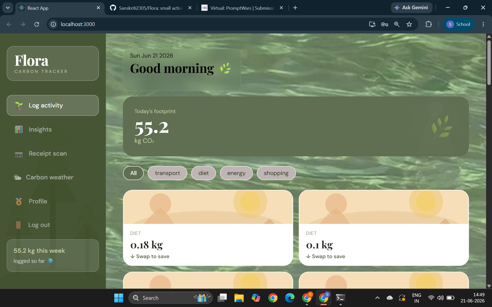
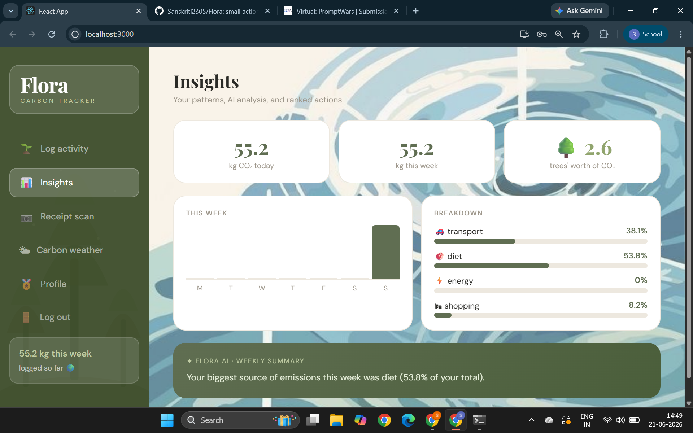
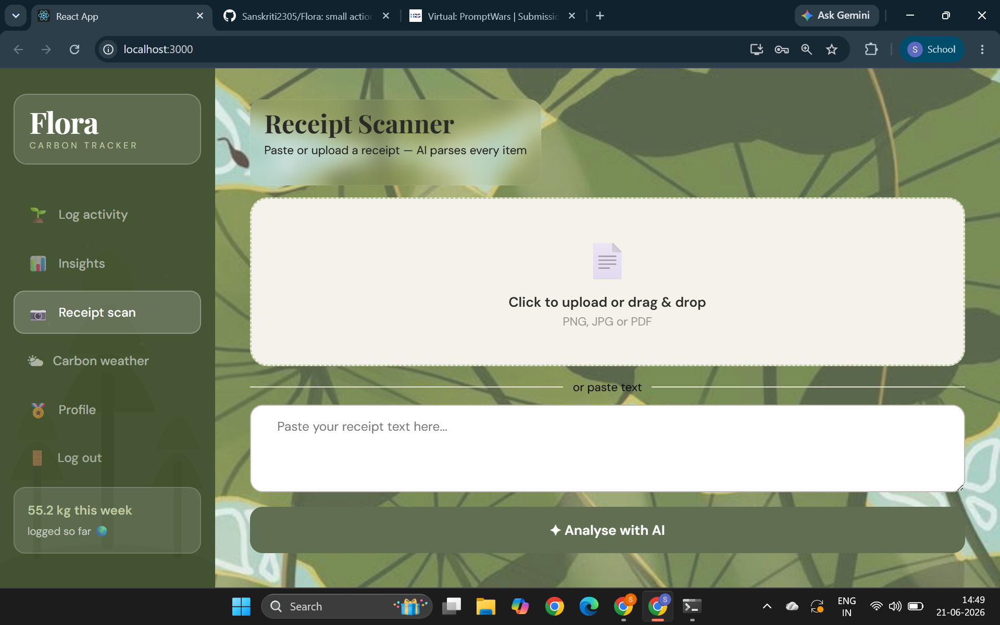
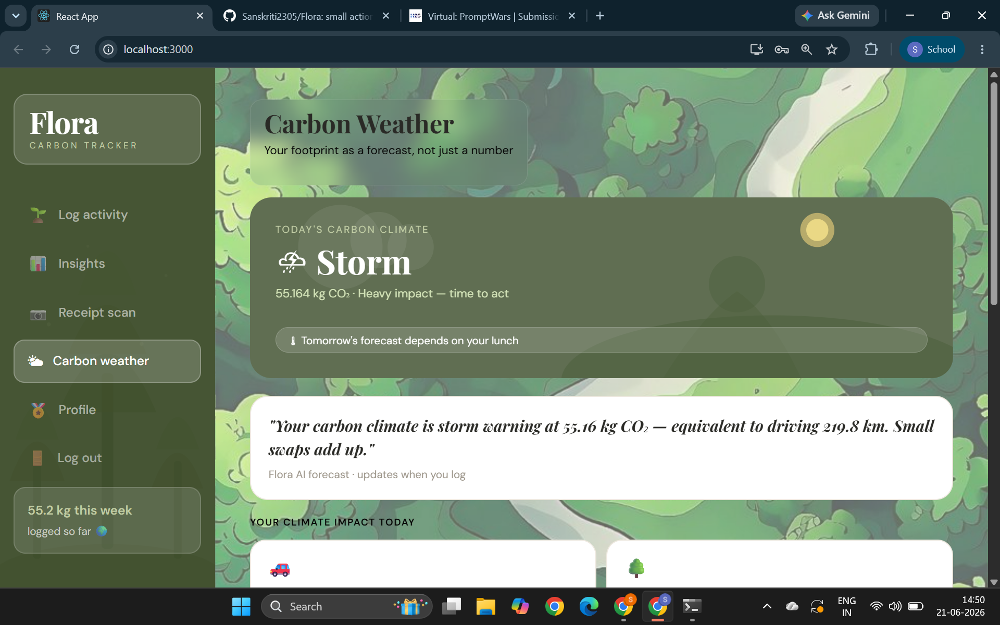
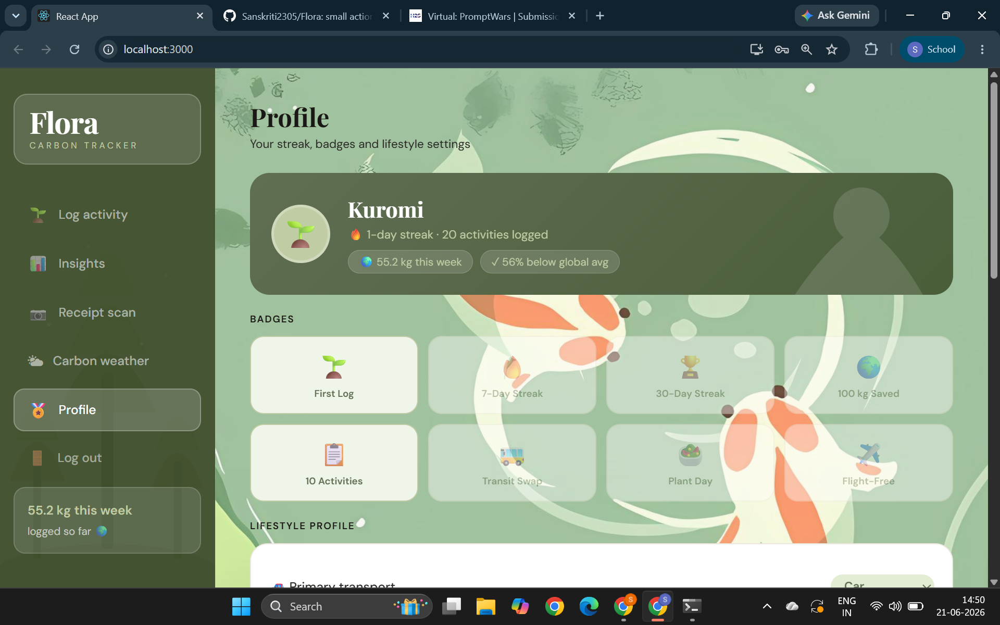

# 🌿 Flora — Carbon Footprint Awareness Platform

> *Small actions, tracked beautifully.*

Flora turns abstract carbon numbers into something you can actually feel — a weather forecast for your footprint, AI-powered swap suggestions, and a receipt scanner that logs your groceries automatically. Built for people who care about the planet but don't have time to be climate scientists.

---
🌐 **Live demo:** [flora-gray.vercel.app](https://flora-gray.vercel.app)

---
## 🌍 The Problem

Most carbon trackers show you a number and leave you stuck. "You emitted 4.2 kg CO₂ today" — but what does that *mean*? What should you *do* about it? Flora answers both questions, every single day.

---

## ✨ What Makes Flora Different

### ⛅ Carbon Weather — not just a number
Instead of a raw CO₂ figure, Flora gives you a **weather forecast for your footprint**:
- ☀️ **Clear** (under 1 kg) — exceptional day
- ⛅ **Partly Cloudy** (1–3 kg) — mild, small swaps would help
- 🌧 **Rainy** (3–6 kg) — above average, check your top category
- ⛈ **Storm** (6 kg+) — heavy impact, time to act

Nobody frames personal carbon as a forecast. It's memorable, demeable in 30 seconds, and genuinely different visual language.

### 🔄 Swap System — action, not guilt
Every logged activity generates a **contextual swap suggestion** with real CO₂ savings calculated using IPCC/EPA emission factors. Users can Accept or Decline each swap — accepted swaps update their totals in real time across Insights and Profile.

### 📄 AI Receipt Scanner — zero-friction logging
Upload a photo or paste grocery receipt text → Gemini vision extracts every food item → Flora scores each ingredient's CO₂ using its own sourced emission factor table (AI extracts facts; Flora does all the math). One receipt logs 10 activities in seconds.

### 🤖 AI Weekly Summary
Gemini writes a 2–3 sentence natural language summary of your week — but only describes numbers Flora has already computed deterministically. **AI never touches the carbon math.** This boundary is explicit and auditable in the codebase.

---

## 🖥 Screenshots

| Home — Log Activity | Insights | Receipt Scanner |
|---|---|---|
|  |  |  |

| Carbon Weather | Profile & Badges |
|---|---|
|  |  |

---

## 🏗 Architecture

```
┌─────────────────────────────────────────────────────┐
│                   React Frontend                     │
│  Home · Insights · Scanner · Weather · Profile       │
│  DM Sans + Playfair Display · Earthy green palette   │
└──────────────────────┬──────────────────────────────┘
                       │ REST API (fetch via api.js)
┌──────────────────────▼──────────────────────────────┐
│              FastAPI Backend (Python)                │
│                                                      │
│  parser.py      → rule-based activity classifier    │
│  carbon_math.py → IPCC/EPA emission factor tables   │
│  ai_fallback.py → Gemini (text extraction ONLY)     │
│  main.py        → routes, streak logic, badges      │
└──────────────────────┬──────────────────────────────┘
                       │ SQLAlchemy ORM
┌──────────────────────▼──────────────────────────────┐
│              SQLite Database (flora.db)              │
│  ActivityLog · UserProfile                           │
└─────────────────────────────────────────────────────┘
```

**Key design principle:** AI is used for two things only — natural language classification (when the rule-based parser can't match) and receipt text extraction. All CO₂ calculations use Flora's own sourced, auditable emission factor tables. The AI never calculates carbon values.

---

## 🔬 Emission Factors (Scientific Accuracy)

Flora uses IPCC AR6 and EPA eGRID emission factors throughout:

| Category | Mode | Factor | Source |
|---|---|---|---|
| Transport | Car (petrol) | 0.21 kg CO₂/km | IPCC AR6 |
| Transport | Bus | 0.089 kg CO₂/km | IPCC AR6 |
| Transport | Train | 0.041 kg CO₂/km | IPCC AR6 |
| Transport | Flight | 0.255 kg CO₂/km | IPCC AR6 |
| Diet | Beef | 27.0 kg CO₂/kg | Poore & Nemecek 2018 |
| Diet | Chicken | 6.9 kg CO₂/kg | Poore & Nemecek 2018 |
| Diet | Vegan meal | 1.5 kg CO₂/kg | Poore & Nemecek 2018 |
| Energy | Electricity (UK grid) | 0.233 kg CO₂/kWh | EPA eGRID |
| Energy | Natural gas | 0.203 kg CO₂/kWh | EPA eGRID |

---

## 🚀 Running Flora Locally

### Prerequisites
- Python 3.12+
- Node.js 18+
- A Gemini API key ([get one free](https://aistudio.google.com))

### Backend

```bash
cd backend
pip install -r requirements.txt

# Create .env file
echo "GEMINI_API_KEY=your_key_here" > .env

# Start the API
uvicorn main:app --reload
# → Running at http://127.0.0.1:8000
```

### Frontend

```bash
cd frontend
npm install
npm start
# → Running at http://localhost:3000
```

### You should see
- Backend: `http://127.0.0.1:8000/docs` — interactive API docs
- Frontend: `http://localhost:3000` — Flora UI

---

## 📁 Project Structure

```
Flora/
├── backend/
│   ├── main.py          # FastAPI routes — check-in, stats, insights, profile
│   ├── carbon_math.py   # All CO₂ calculations — IPCC/EPA factors, never AI
│   ├── parser.py        # Rule-based activity classifier (tier 1)
│   ├── ai_fallback.py   # Gemini calls — classification fallback + receipt OCR
│   ├── database.py      # SQLAlchemy models — ActivityLog, UserProfile
│   └── requirements.txt
├── frontend/
│   ├── src/
│   │   ├── App.js           # Root — shared state, sidebar, routing
│   │   ├── api.js           # All backend calls in one place
│   │   ├── pages/
│   │   │   ├── home.jsx     # Log activity + swap suggestions
│   │   │   ├── insights.jsx # Charts, AI summary, peer comparison
│   │   │   ├── scanner.jsx  # Receipt upload + text paste
│   │   │   ├── weather.jsx  # Carbon weather forecast
│   │   │   └── profile.jsx  # Badges, streak, lifestyle settings
│   │   └── index.css        # Design tokens — colors, fonts, radius
│   └── package.json
└── README.md
```

---

## 🔌 API Endpoints

| Method | Route | Description |
|---|---|---|
| POST | `/check-in` | Log an activity (natural language input) |
| POST | `/preview-swap` | Preview CO₂ cost + swap suggestion without logging |
| POST | `/receipt-scan` | Parse receipt text → score each food item |
| POST | `/scan-receipt-image` | Upload receipt image → OCR → score items |
| GET | `/stats` | Total CO₂ saved for a period |
| GET | `/history` | Recent activity log |
| GET | `/weather` | Today's carbon weather |
| GET | `/insights` | Weekly charts, breakdown, AI summary, peer percentile |
| GET | `/profile` | User profile, streak, badges |
| PATCH | `/profile` | Update lifestyle settings |

---

## 🎮 Gamification

Flora rewards consistent logging without manufactured pressure:

| Badge | Condition |
|---|---|
| 🌱 First Log | Log your first activity |
| 🔥 7-Day Streak | Log 7 consecutive days |
| 🏆 30-Day Streak | Log 30 consecutive days |
| 🌍 100 kg Saved | Save 100 kg CO₂ through swaps |
| 📋 10 Activities | Log 10 total activities |

Streaks are computed server-side on every check-in — no client-side faking possible.

---

## 🛡 Technical Decisions Worth Noting

**Why SQLite?** Zero setup. Any judge can clone and run instantly with no external database server. SQLAlchemy ORM means switching to PostgreSQL for production is a one-line connection string change.

**Why anonymous user IDs?** Flora generates a random ID in localStorage — no signup friction, no email collection, but still meaningful per-user stats and streaks. Privacy-first by default.

**Why separate `carbon_math.py`?** Every CO₂ number in Flora traces back to a single auditable file with explicit source citations. The AI layer never touches this file. This is the most important architectural boundary in the codebase.

**Why Gemini for receipts?** Receipt text varies wildly — handwritten, photo, different languages, abbreviations. Rule-based parsing fails here. Gemini's vision model extracts the facts; Flora's own tables do the math.

---

## 🌱 Built With

- **Frontend:** React 18, DM Sans + Playfair Display, inline styles with CSS variables
- **Backend:** FastAPI, SQLAlchemy, SQLite, Python 3.12
- **AI:** Google Gemini 2.5 Flash (text + vision)
- **Emission data:** IPCC AR6, EPA eGRID, Poore & Nemecek (2018)

---

## 👩‍💻 Team

Built for the PromptWars Virtual Hackathon — Challenge 3: Carbon Footprint Awareness Platform.

*Flora: because small actions, compounded, change everything.*

---

<div align="center">
  <strong>🌿 Every action counts.</strong>
</div>
